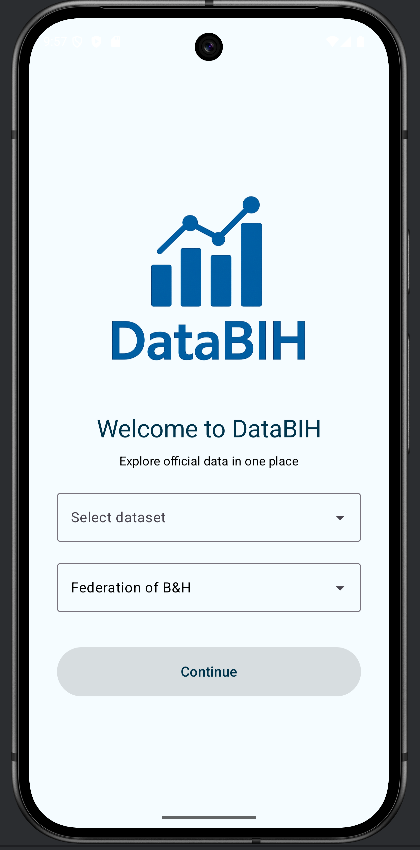
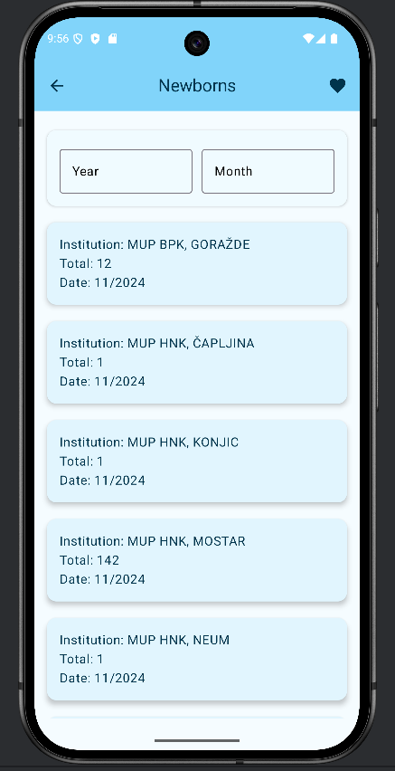
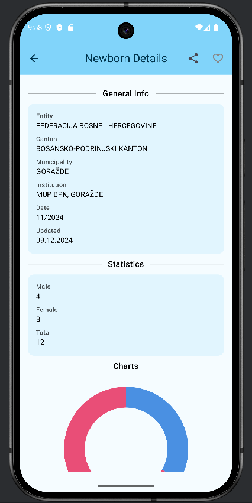
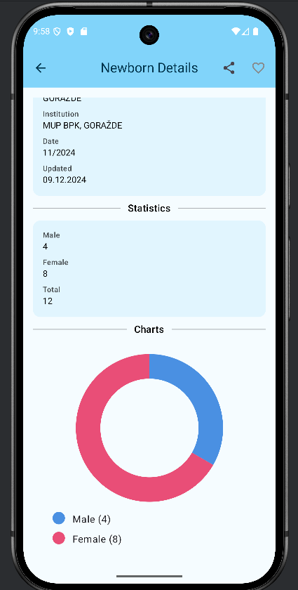
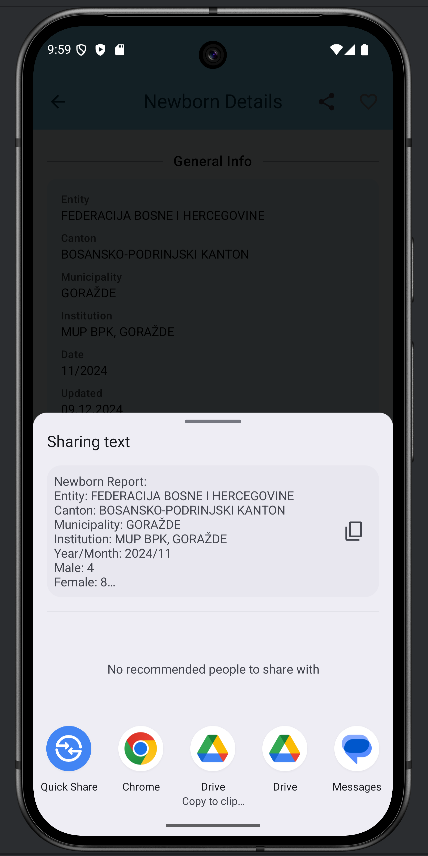
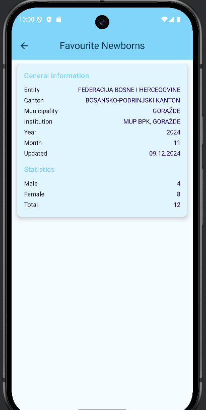
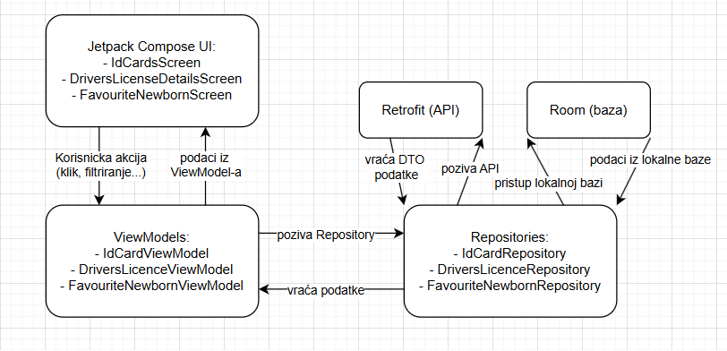

## Uvod u aplikaciju

Ova Android aplikacija omogućava korisnicima pregled javno dostupnih podataka sa _Open Data Portala Bosne i Hercegovine_. Aplikacija prikazuje tri kategorije informacija:

- Broj rođenih beba
- Broj izdatih ličnih karata
- Broj izdatih vozačkih dozvola

### Onboarding

Na početnom ekranu korisnik bira entitet (_Federacija BiH_, _Republika Srpska_ ili _Brčko Distrikt_) i jednu od ponuđenih kategorija podataka.



---

### Lista podataka

Nakon odabira, korisnik dolazi na ekran sa listom rezultata, uz mogućnost filtriranja po godini i mjesecu.



---

### Detalji i grafički prikaz

Klikom na određenu stavku otvara se ekran sa detaljima, uključujući:

- Dodatne informacije o odabranoj stavci
- Grafički prikaz u obliku pie charta
- Dugme za dijeljenje informacija

  
  


---

### Favoriti

Korisnik može označiti pojedine stavke kao _favorite_ te ih kasnije pregledati na posebnom ekranu — bez potrebe za ponovnim pretraživanjem.



---

### Korištene tehnologije

U aplikaciji su korišteni sljedeći alati i biblioteke:

- **Jetpack Compose** – za jednostavno i moderno kreiranje korisničkog interfejsa
- **MVVM (Model-View-ViewModel)** – za odvajanje logike od UI-a
- **Retrofit** – za komunikaciju s Open Data API-jem
- **Room** – za lokalno čuvanje podataka (favoriti)
- **Kotlin Coroutines + Flow** – za rad s podacima koji se učitavaju asinhrono

---

## Arhitektura aplikacije

Aplikacija koristi MVVM arhitekturu (Model-View-ViewModel), što znači da su logika, podaci i prikaz odvojeni u posebne dijelove. Na taj način je kod organizovan, lakši za čitanje i održavanje.

---

### View (UI)

Korisnički interfejs je napravljen pomoću **Jetpack Compose**.

Svaki ekran je posebna `Composable` funkcija koja prikazuje podatke i reaguje na promjene stanja. Primjeri ekrana:

- `IdCardsScreen` – prikazuje listu ličnih karata i omogućava filtriranje
- `DriversLicenseDetailsScreen` – prikazuje detalje o vozačkoj dozvoli, graf i dugme za dijeljenje
- `FavouriteNewbornScreen` – prikazuje sve sačuvane omiljene stavke

UI koristi podatke koje šalje ViewModel i šalje nazad korisničke akcije (klikove, unose...).

---

### ViewModel

ViewModel je posrednik između UI-a i ostatka aplikacije. On:

- prima akcije iz View-a (npr. filtriranje),
- obrađuje ih i zove Repository,
- vraća novo stanje nazad u UI.

Svaka kategorija ima svoj ViewModel, npr.:

- `NewbornViewModel`, `IdCardViewModel`, `DriversLicenceViewModel` – za dohvat i filtriranje podataka
- `Favourite-X-ViewModel` – za rad sa lokalnom bazom (Room)

ViewModel koristi `viewModelScope.launch` za asinhroni rad i `StateFlow` za slanje podataka prema UI-ju.

---

### Repository

Repository odlučuje odakle dolaze podaci – sa API-ja ili iz baze.

- `X-Repository.kt` koristi Retrofit za pozivanje API-ja
- `Favourite-X-Repository.kt` koristi Room za rad s lokalnim favoritima

Rezultati se vraćaju kao `Result<List<...>>`.

Osim čuvanja omiljenih stavki, aplikacija koristi Room bazu za keširanje kompletnih podataka koje preuzima sa Open Data API-ja. To znači da se podaci o novorođenima, ličnim kartama i vozačkim dozvolama pohranjuju lokalno u bazu odmah nakon uspješnog preuzimanja sa mreže.

Ovo keširanje omogućava aplikaciji da:

- Prikaže podatke korisniku čak i kada nema internet konekciju,
- Omogući korisniku nesmetan rad i pregled podataka offline.

Implementacija keširanja je urađena tako što nakon uspješnog poziva API-ja, Repository briše stare podatke u odgovarajućoj Room tabeli i ubacuje nove.

Na taj način lokalna baza uvijek sadrži ažurirane informacije koje su dostupne za brzi pristup.

---

### Modeli

Model sloj sadrži tri vrste klasa:

- **DTO klase** (`NewbornDto`, `IdCardDto`...) – podaci dobijeni direktno s API-ja
- **Entity klase** (`NewbornEntity`, `FavouriteIdCard`...) – za lokalnu bazu
- **Data klase** (`Newborn`, `IdCard`, `DriversLicence`) – podaci koje koristi UI

Podaci se pretvaraju pomoću `.toModel()` i `.toEntity()` funkcija.

---

### Tok podataka kroz aplikaciju

1. Korisnik nešto klikne (npr. filtrira)
2. View šalje akciju ViewModel-u
3. ViewModel zove Repository
4. Repository uzima podatke (API ili baza)
5. Podaci se konvertuju u odgovarajući model
6. ViewModel ažurira stanje
7. UI automatski prikazuje nove podatke

Sve se odvija asinhrono pomoću coroutines i flow, pa aplikacija radi glatko i bez čekanja.



## Opis funkcionalnosti ključnih klasa

### ViewModel klase

#### `NewbornViewModel`

- Zadužen za dohvaćanje podataka o novorođenima.
- Koristi `MutableStateFlow<NewbornUiState>` za slanje stanja (`Loading`, `Success`, `Error`) prema UI-ju.
- Kada korisnik promijeni filter (godinu/mjesec), poziva se `loadNewborns()`:
  - Priprema `RequestDto`
  - Poziva `NewbornRepository`
  - Rezultat smješta u odgovarajući state

#### `IdCardViewModel`

- Ista logika kao kod `NewbornViewModel`, ali za lične karte.
- Koristi `IdCardRepository` i `StateFlow<IdCardUiState>`.
- Funkcija `loadIdCards()` koristi trenutni filter za dohvaćanje podataka.
- Sve se pokreće asinhrono putem `viewModelScope.launch`.

#### `DriversLicenceViewModel`

- Radi sa podacima o vozačkim dozvolama.
- Koristi vlastiti `StateFlow` i `DriversLicenceRepository`.
- Filter se postavlja ručno preko `updateFilter()`, a podaci se dohvaćaju sa `loadDriversLicences()`.

#### `FavouriteNewbornViewModel`

- Radi sa Room bazom putem `FavouriteNewbornRepository`.
- `val favourites = repository.getAllFavourites()` vraća `Flow<List<...>>`, pa se UI automatski osvježava.
- Omogućava dodavanje i uklanjanje favorita (`addToFavourites`, `removeFromFavourites`).
- Podaci se konvertuju u `FavouriteNewbornEntity`.

#### `FavouriteIdCardViewModel` i `FavouriteDriversLicenceViewModel`

- Isti princip kao kod `FavouriteNewbornViewModel`.
- Koriste odgovarajuće DAO-e i entitete (`FavouriteIdCard`, `FavouriteDriversLicence`).
- Razlika je samo u tipu podataka koji se obrađuje.

---

### Repository klase

#### `NewbornRepository`

- Vrši poziv prema API-ju (`OpenDataApi`) koristeći Retrofit.
- Podatke mapira iz `NewbornDto` u `Newborn` preko `.toNewborn()`.
- U slučaju greške vraća `Result.failure`, u suprotnom `Result.success`.
- Glavna logika se nalazi u `loadNewborns()` funkciji (sa `try/catch` blokovima).

#### `IdCardRepository`

- Isto kao `NewbornRepository`, ali za lične karte.
- Radi konverziju `IdCardDto → IdCard`.
- Rukuje praznim odgovorima i greškama.

#### `DriversLicenceRepository`

- Radi sa `DriversLicenceDto` i vraća `DriversLicence` modele.
- Koristi `RequestDto` za slanje filtera i mapira rezultat iz `DriversLicenceResponseDto`.

#### `FavouriteNewbornRepository`

- Radi sa Room bazom.
- Glavne funkcije:
  - `insert(favourite: FavouriteNewbornEntity)`
  - `delete(favourite: FavouriteNewbornEntity)`
  - `getAllFavourites(): Flow<List<...>>`
- Koristi `FavouriteNewbornDao`.

#### `FavouriteIdCardRepository` i `FavouriteDriversLicenceRepository`

- Isti princip kao kod `FavouriteNewbornRepository`.
- Razlika je samo u DAO klasama i entitetima.

---

### DAO interfejsi

#### `NewbornDao`, `IdCardDao`, `DriversLicenceDao`

- Zaduženi za privremeno čuvanje podataka iz API-ja:
  - `insertAll(items: List<...>)` – unos
  - `getAll(): List<...>` – dohvaćanje svih zapisa
  - `clear()` – brisanje starih podataka
- Omogućavaju fallback kada API nije dostupan.

#### `Favourite-X-Dao` (za sve tri kategorije)

- Osnovne metode za rad sa favoritima:
  - `insert(item: Favourite...)`
  - `delete(item: Favourite...)`
  - `getAll(): Flow<List<...>>`
- `Flow` omogućava da se UI automatski osvježi pri izmjenama.

---

### Ključne `Composable` funkcije

#### `FilterComponent`

- Koristi **dva `OutlinedTextField` elementa** – jedan za unos godine, drugi za mjesec
- **`DropdownMenu`** prikazuje sve dostupne mjesece za odabir
- **`onFilterChange`** lambda funkcija se poziva svaki put kada se promijeni filter

Unesene vrijednosti se pamte pomoću `remember { mutableStateOf(...) }`, čime se osigurava da vrijednosti ostanu sačuvane i nakon što se ekran ponovo renderuje.  
Kada korisnik izmijeni filter, poziva se `onFilterChange(...)`, koja šalje nove parametre ka ViewModel-u. ViewModel tada učitava podatke na osnovu novih vrijednosti.

Komponenta je dizajnirana da bude **ponovno upotrebljiva** na svim relevantnim ekranima (`Newborns`, `IdCards`, `DriversLicences`), bez potrebe za pisanjem posebne filter logike za svaki ekran.

Podržava osnovnu validaciju — npr. onemogućava unos slova u polje za godinu — što pomaže u izbjegavanju grešaka pri slanju podataka ka API-ju.

#### `FavouriteHeartButton`

- Prikazuje srce (puno/prazno) u zavisnosti da li je stavka favorit.
- Klikom se poziva dodavanje ili brisanje iz baze.
- Boja se dinamički mijenja prema statusu.

#### `ShareButton`

- Omogućava dijeljenje podataka kroz druge aplikacije (poruke, email...).
- Poziva `shareData()` koja koristi Android `Intent`.

#### `SectionHeader`

- Jednostavan naslov sekcije.
- Koristi `Text` i `Modifier.padding`.

#### ℹ `InfoRow`

- Prikazuje informacije u formatu: naziv → vrijednost.
- Primjeri: `"Pol: Muški"`, `"Općina: Novo Sarajevo"`.

#### `PieChartData.kt`

- Funkcija za pie chart koristeći `Canvas`.
- Prikazuje npr. raspodjelu po spolu.
- Boje i postoci se računaju dinamički.

## Android i Jetpack koncepti korišteni u aplikaciji

Aplikacija koristi moderne Android tehnologije kao što su **Jetpack Compose**, **Room**, **ViewModel**, **Retrofit** i **Navigation Compose**. Sve je organizovano prema MVVM arhitekturi, kako bi logika bila odvojena od prikaza i lakša za održavanje.

---

### Room

Room je biblioteka koja služi za rad sa lokalnom SQLite bazom. U ovoj aplikaciji Room se koristi za spremanje favorita i caching datasetova, kako bi korisnik mogao pristupiti tim podacima i kada nema pristup internetu.

Za svaku kategoriju podataka (novorođenčad, lične karte, vozačke dozvole) postoji zasebna entitetska klasa koja predstavlja strukturu podataka u bazi. Entiteti su definirani pomoću `@Entity` anotacije i sadrže sve potrebne atribute kao što su godina, mjesec, institucija i ostale informacije koje su relevantne za tu kategoriju.

Pored entiteta, za svaku kategoriju postoji i odgovarajući DAO (Data Access Object). DAO je zadužen za osnovne operacije nad bazom podataka kao što su:

- ubacivanje novih podataka (`insert`),
- brisanje podataka (`delete`),
- dobavljanje svih podataka (`getAll`),
- brisanje svih starih podataka (`clear`).

Sve metode u DAO interfejsima koriste Kotlin `suspend` funkcije ili `Flow` za asinhroni rad. Posebno je značajno što su metode za dobavljanje podataka definirane da vraćaju `Flow<List<...>>`, što omogućava da se UI automatski osvježi svaki put kada se podaci u bazi promijene, bez potrebe za ručnim osvježavanjem ili dodatnim pozivima.

Room baza je integrirana u aplikaciju kroz klasu `AppDatabase` koja objedinjuje sve entitete i DAO-e. Za pristup bazi koristi se singleton objekat `DatabaseProvider` koji osigurava da postoji samo jedna instanca baze u toku rada aplikacije.

---

### ViewModel

ViewModel čuva trenutno stanje koje aplikacija prikazuje korisniku.  
Za svaku kategoriju podataka postoji poseban ViewModel koji:

- komunicira sa odgovarajućim Repository slojem
- kontroliše kada treba prikazati `Loading`, `Error` ili `Success` stanje
- koristi `StateFlow` za reaktivno emitovanje stanja ka UI-ju
- koristi `viewModelScope.launch` za asinhrono izvršavanje API poziva

---

### Jetpack Compose i životni ciklus

Svi ekrani aplikacije su napisani pomoću Jetpack Compose biblioteke.

- UI funkcije su reaktivne — automatski se ažuriraju kada se promijeni stanje u ViewModel-u
- Nije potrebno ručno osvježavati prikaz
- `remember` se koristi za lokalna stanja kao što su unos teksta ili selekcije iz menija

---

### State, `remember` i `collectAsState`

- Stanje aplikacije se u ViewModel-u drži pomoću `StateFlow`
- U Composable funkcijama se koristi `collectAsState()` kako bi se stanje pratilo i prikaz automatski osvježavao
- Za lokalna stanja (npr. unos korisnika), koristi se `remember { mutableStateOf(...) }`

---

### Coroutines i Flow

Svi pozivi koji učitavaju podatke (npr. iz API-ja ili baze) koriste **Kotlin Coroutines**.  
Korištenjem `Flow`, omogučava se slijedeće:

- UI automatski osvježi čim se podaci promijene
- liste, detalji i favoriti prate izmjene bez dodatne logike

---

### Retrofit

Retrofit omogućava komunikaciju s Open Data API-jem BiH.

- koristi se POST zahtjev sa `RequestDto` objektom
- odgovor se dobija kao DTO (`DtoResponse`)
- DTO se konvertuje u UI modele (`.toModel()` funkcije)
- Retrofit je konfigurisan s osnovnim URL-om i potrebnim tokenom

---

### Navigation Compose

Navigacija kroz aplikaciju implementirana je pomoću **Navigation Compose** biblioteke.

- Svaki ekran je definisan kao **ruta**
- Parametri se šalju između ekrana kao **JSON string** pomoću `navController.navigate(...)`
- Na odredišnom ekranu, podaci se dekodiraju pomoću **Gson** biblioteke nazad u objekat

---

### Material 3

UI je dizajniran prema **Material 3** dizajn principima.  
Korištene komponente uključuju:

- `Card`, `Text`, `Button`, `TopAppBar`, `OutlinedTextField`, itd.
- Tema aplikacije je svijetla i jednostavna
- Elementi su raspoređeni pregledno i prilagođeni korisnicima

---

## Struktura projekta

```
├── data/
│   ├── local/
│   │   ├── dao/
│   │   └── entity/
│   ├── model/
│   ├── network/
│   │   └── dto/
│   ├── repository/
│   └── SelectedPreferences
├── presentation/
│   ├── components/
│   ├── navigation/
│   ├── screens/
│   │   ├── newborn/
│   │   ├── idcards/
│   │   └── driverslicenses/
│   └── OnboardingScreen.kt
├── ui.theme/
├── util/
├── viewmodel/
│   ├── factory/
│   ├── uistate/
│   └── ...
└── MainActivity.kt
```

### Šta je gdje u projektu

- **`data/local/`** – tu su Room fajlovi za lokalnu bazu: entiteti i DAO-i.
- **`data/model/`** – modeli koje koristi aplikacija (pretvoreni iz DTO-a).
- **`data/network/`** – ovdje se nalazi Retrofit i sve vezano za API komunikaciju.
- **`data/repository/`** – fajlovi koji služe da ViewModel može lako doći do podataka.
- **`SelectedPreferences`** – fajl u kojem se čuva koji je entitet korisnik izabrao (npr. Federacija).

- **`presentation/components/`** – manji djelovi UI-ja koji se mogu ponovo koristiti (filter, dugme za share...).
- **`presentation/navigation/`** – kod za navigaciju između ekrana.
- **`presentation/screens/`** – svi ekrani aplikacije, podijeljeni po datasetima (novorođeni, lične...).
- **`OnboardingScreen.kt`** – početni ekran gdje korisnik bira entitet i dataset.

- **`ui.theme/`** – boje i stilovi aplikacije.
- **`util/`** – pomoćne funkcije

- **`viewmodel/`** – svi ViewModeli, factory fajlovi i klase za stanje prikaza.
